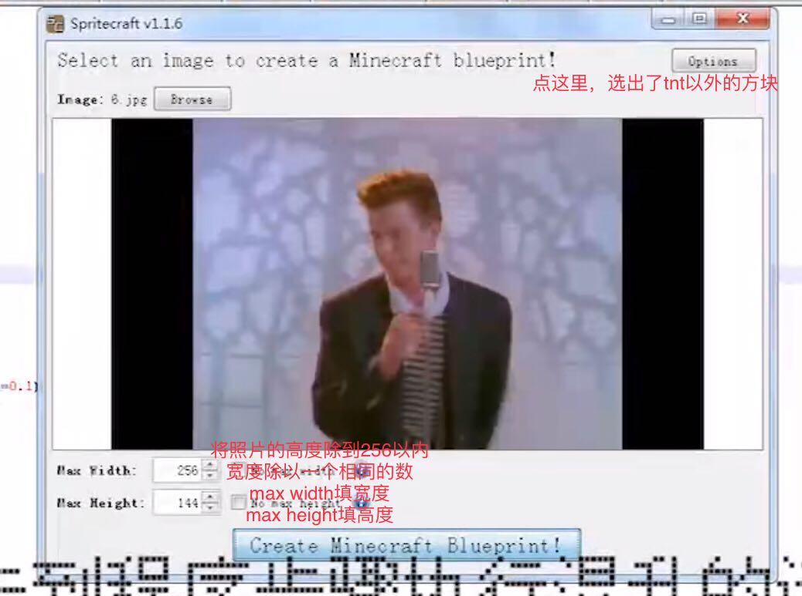

# MC_Pixel_Video_Tools
在MC中播放像素视频的工具
关于脚本的教程参见这个视频
https://www.bilibili.com/video/BV1BP4y1W7xd/

# 关于Spritecraft的配置
我发给粉丝的一幅图能很好的讲解

# 关于最近脚本的更新和变动
我会上传一个经过pyinstaller打包的可执行文件
同时读帧脚本改为了输入文件名以打开文件
添加了检查.py，用于检查转换出的schematic文件是否有缺失

# 关于Python及第三方库的安装
去python.org装Python3
之后用本库requirements.txt的执行pip3 install -r requirements.txt
